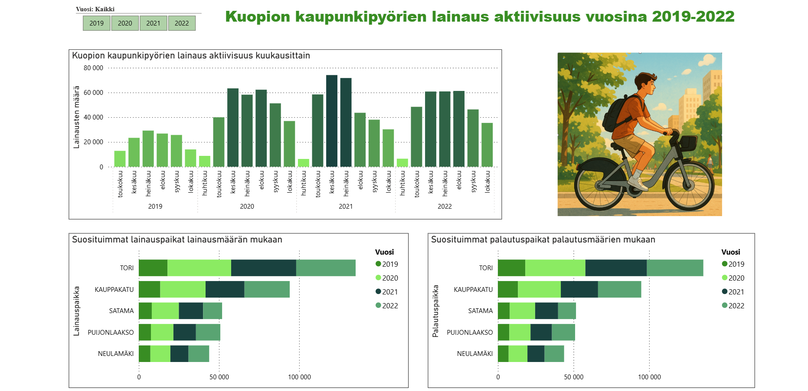
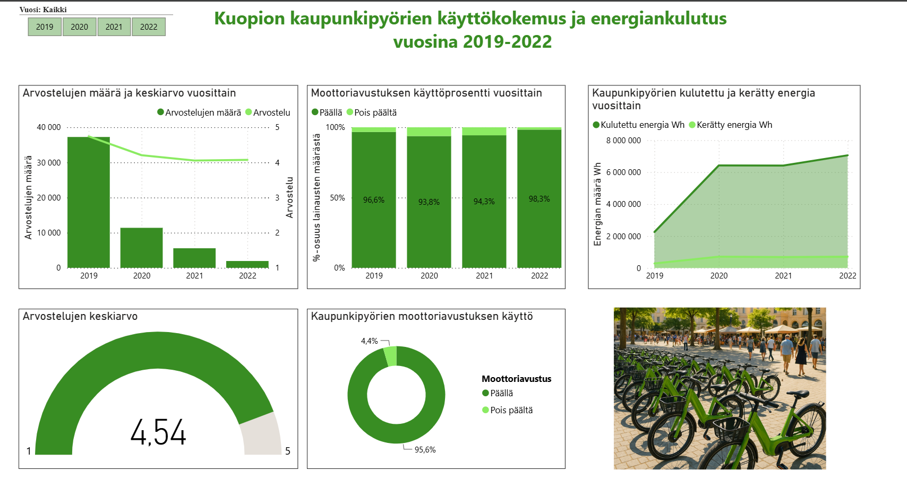

# Kuopio City Bikes Analytics Dashboard

Power BI analytics project based on open data from Kuopio city bike usage statistics (2019–2022).

## Project Overview

This project analyzes four years of city bike usage data and visualizes usage patterns, customer behavior, electric assist utilization and energy consumption.

## Technologies

- Power BI
- Power Query
- Data Modeling
- Data Visualization
- CSV Data Sources

## Dashboard Preview

## Interactive Dashboard

📊 [Open Power BI Dashboard](https://app.powerbi.com/view?r=eyJrIjoiY2NkZDVlODktMGU2MC00MGIwLWJkMDUtNDAzN2ZhOTFkOTNkIiwidCI6ImI2ZDU2ODFiLTRhNDAtNGQzYS04ZTdiLTAzYTcwZDM5OTFiNiIsImMiOjh9)

## Features

### Data Preparation

- Combined multiple CSV datasets
- Cleaned and transformed data
- Standardized columns and values
- Filtered maintenance records

### Dashboard 1: Rental Activity

- Monthly usage trends
- Top rental stations
- Top return stations
- Interactive year filtering

### Dashboard 2: User Experience & Energy Analysis

- User ratings analysis
- Electric assist usage
- Energy consumption tracking
- KPI reporting

## Key Findings

- July was consistently the busiest month
- City bike season expanded over time
- Electric assist usage exceeded 95%
- Average user rating remained above 4/5

## Skills Demonstrated

- Power BI
- Power Query
- Data Transformation
- Data Analysis
- Dashboard Design
- Data Visualization
- Business Reporting

## Full Report

[Read here the report](report/kuopio-city-bikes-analytics-report.pdf)
